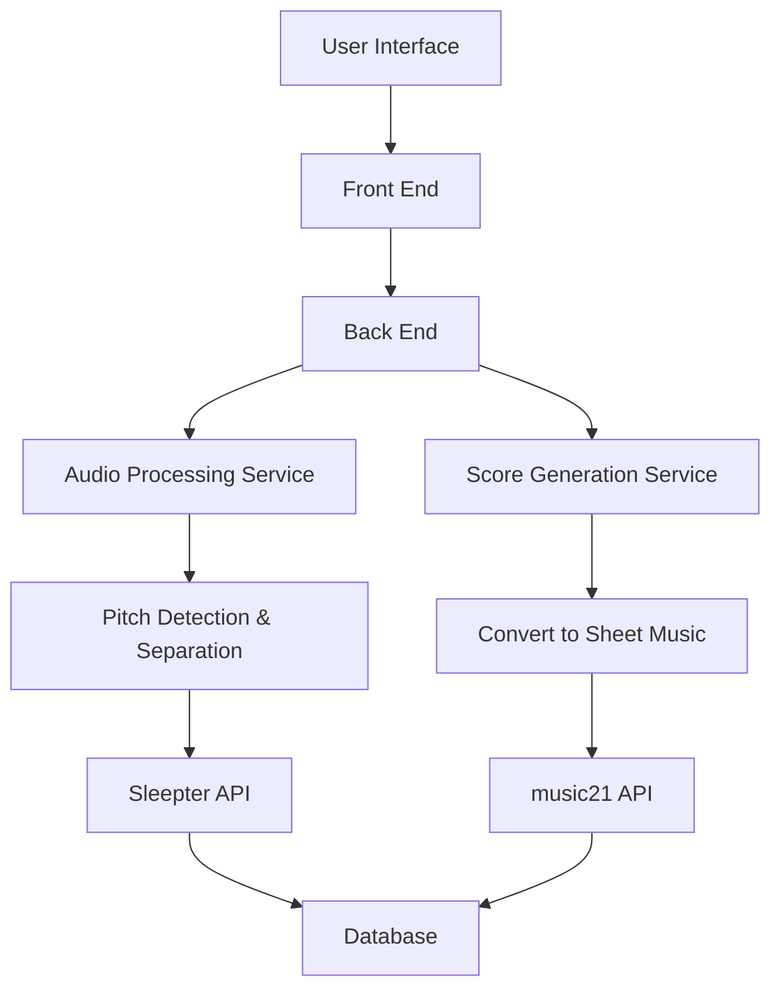

# Getting Started
Spleeter API: https://github.com/deezer/spleeter.git

Music API: https://github.com/cuthbertLab/music21.git

# Model and Engine

## Story Map

## Component List

1. Front End
   - **User Interface (UI)**: Provides a user-friendly interface for uploading audio files and editing sheet music.
   - **Audio File Upload**: Allows users to upload their audio files for processing.
   - **Sheet Music Editor**: Enables users to edit and view generated sheet music.
2. Back End
   - **Audio Processing API**: Manages the audio processing tasks such as pitch detection and track separation.
   - **User Management**: Handles user authentication, authorization, and profile management.
   - **Data Storage**: Manages the storage and retrieval of user data, audio files, and generated scores.
3. Audio Processing Service
   - **Audio Preprocessing**: Prepares the audio file for further analysis by normalizing and filtering.
   - **Pitch Detection**: Identifies the pitch of the audio signals.
   - **Vocal and Accompaniment Separation**: Separates the vocal track from the accompaniment using Spleeter.
4. Score Generation Service
   - **Convert Pitch Data to Sheet Music**: Uses pitch data to create musical notation.
   - **Export Sheet Music**: Provides options to export the generated sheet music in various formats.
5. Database
   - **User Data Storage**: Stores user information such as credentials and profile data.
   - **Audio and Score Data** Storage: Manages the storage of audio files and generated sheet music.
6. Third-Party Libraries and Tools
   - **Spleeter**: Used for separating vocal and accompaniment tracks.
   - **YIN/CREPE**: Employed for accurate pitch detection.
   - **Music21**: Utilized for generating and manipulating sheet music.
   - **React/Vue**: Front-end development frameworks.
   - **Node.js/Express**: Back-end development frameworks.
   - **MongoDB/PostgreSQL**: Databases for data storage.

## Data and Control Flow

### Implementation Plan

1. Front End
   - **Functionality**: User interface for audio file upload and sheet music editing.
   - **Implementation**: Developed with React.js or Vue.js for a responsive UI.
2. Back End
   - **Functionality**: Manages server-side operations and API communication.
   - **Implementation**: Built with Node.js and Express.js for handling requests and routing.
3. Score Generation Handler
   - **Functionality**: Converts audio data into musical scores.
   - **Implementation**: Integrates with Music21 API to generate sheet music from pitch data.
4. Music21 API
   - **Functionality**: Provides tools for music analysis and score generation.
   - **Implementation**: Uses Python scripts to interface with Music21 for score creation.
5. Audio Processing Handler
   - **Functionality**: Extracts musical features from audio files.
   - **Implementation**: Utilizes LibROSA for pitch detection and other audio analyses.
6. Spleeter API
   - **Functionality**: Separates vocal and accompaniment tracks.
   - **Implementation**: Applies Spleeter for audio source separation.

# APIs and Controller

**Request Parameters**
| Key        | Location | Type   | Description      |
| ---------- | -------- | ------ | ---------------- |
| `username` | Session Cookie| String | Current User |

**Response Codes**
| Code              | Description            |
| ----------------- | ---------------------- |
| `200 OK`     | Success                |
| `400 Bad Request` | Invalid parameters     |

**Returns**

*If no user is logged in or no posts created by user*
| Key        | Location       | Type   | Description  |
| ---------- | -------------- | ------ | ------------ |
| `popular_songs` | JSON | List of Spotify Track IDs | Top 25 songs on Spotify in the United States |

*For logged-in users with 1 or more posts created*
| Key        | Location       | Type   | Description  |
| ---------- | -------------- | ------ | ------------ |
| `attribute_recommendations` | JSON |List of Spotify Track IDs | Attribute-based recommendations (random genres) |
| `genre_recommendations` | JSON | List of Spotify Track IDs | Attribute and genre-based recommendations based on user's favorite genres |
| `artist_recommendations` | JSON | List of Spotify Track ID | Attribute and artist-based recommendations based on user's favorite artists | 
| `attribute_error` | JSON | Dictionary | contains the average error % for each attribute between recommendation and the user's attribute vector. | 

**Example**
~~~ 
curl -b cookies.txt -c cookies.txt -X GET https://OUR_SERVER/recommendations/'

{
    "attribute_error": {
        "acousticness": 0.1342,
        "danceability": 0.2567,
        "energy": 0.1144,
        "instrumentalness": 0.021,
        "liveness": 0.0324,
        "loudness": 0.0084,
        "speechiness": 0.0528,
        "tempo": 0.0446,
        "valence": 0.1538
    },
    "attribute_recommendations": [
        "spotify:track:3joo84oco9CD4dBsKNWRRW",
        "spotify:track:5DxlyLbSTkkKjJPGCoMo1O",
        ...
    ],
    "genre_recommendations": [
        "spotify:track:4MzXwWMhyBbmu6hOcLVD49",
        "spotify:track:0bYg9bo50gSsH3LtXe2SQn",
        ...
    ],
    "artist_recommendations": [
        "spotify:track:2EjXfH91m7f8HiJN1yQg97",
        "spotify:track:5o8EvVZzvB7oTvxeFB55UJ",
        ...
    ],
    "url": "/recommendations/"
}
~~~

## Third-Party SDKs

# View UI/UX

# Team Roster
Lingyu Qi: Project Management and UI-Interface Design

Yifan Jia: Database Management

Marco Souza: Front-end Design and Development

Yue Huang: Audio Processing

Jingjing Zhu: Sheet Music Transcribing Algorithm Design

Shuangyu Lei: Pitch Detection
