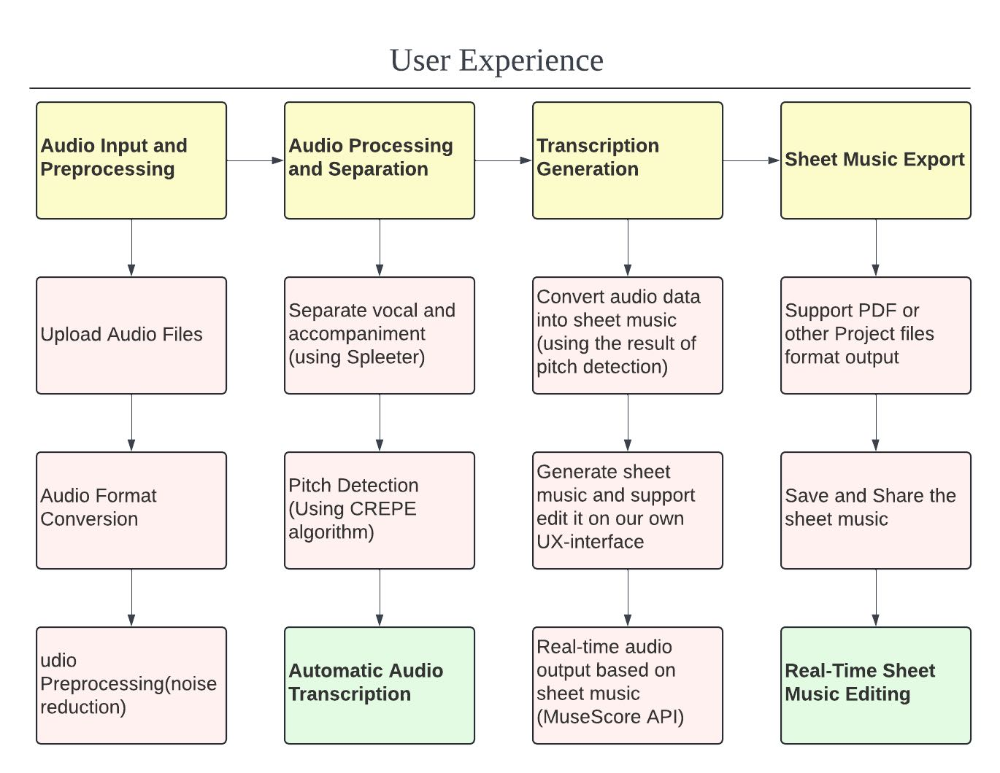
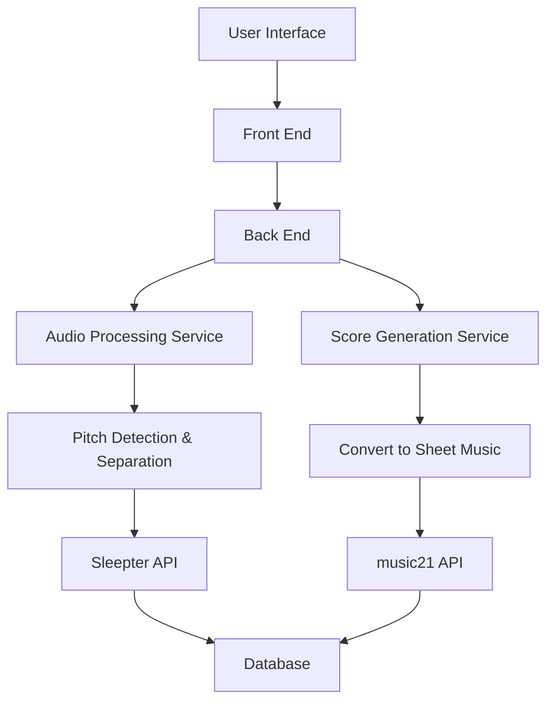
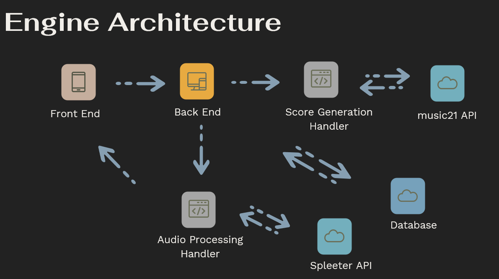

# Getting Started
Spleeter API: https://github.com/deezer/spleeter.git

Music API: https://github.com/cuthbertLab/music21.git

# Model and Engine

## Story Map

## Component List

1. Front End
   - **User Interface (UI)**: Provides a user-friendly interface for uploading audio files and editing sheet music.
   - **Audio File Upload**: Allows users to upload their audio files for processing.
   - **Sheet Music Editor**: Enables users to edit and view generated sheet music.
2. Back End
   - **Audio Processing API**: Manages the audio processing tasks such as pitch detection and track separation.
   - **User Management**: Handles user authentication, authorization, and profile management.
   - **Data Storage**: Manages the storage and retrieval of user data, audio files, and generated scores.
3. Audio Processing Service
   - **Audio Preprocessing**: Prepares the audio file for further analysis by normalizing and filtering.
   - **Pitch Detection**: Identifies the pitch of the audio signals.
   - **Vocal and Accompaniment Separation**: Separates the vocal track from the accompaniment using Spleeter.
4. Score Generation Service
   - **Convert Pitch Data to Sheet Music**: Uses pitch data to create musical notation.
   - **Export Sheet Music**: Provides options to export the generated sheet music in various formats.
5. Database
   - **User Data Storage**: Stores user information such as credentials and profile data.
   - **Audio and Score Data** Storage: Manages the storage of audio files and generated sheet music.
6. Third-Party Libraries and Tools
   - **Spleeter**: Used for separating vocal and accompaniment tracks.
   - **YIN/CREPE**: Employed for accurate pitch detection.
   - **Music21**: Utilized for generating and manipulating sheet music.
   - **React/Vue**: Front-end development frameworks.
   - **Node.js/Express**: Back-end development frameworks.
   - **MongoDB/PostgreSQL**: Databases for data storage.

## Data and Control Flow

### Implementation Plan

1. Front End
   - **Functionality**: User interface for audio file upload and sheet music editing.
   - **Implementation**: Developed with React.js or Vue.js for a responsive UI.
2. Back End
   - **Functionality**: Manages server-side operations and API communication.
   - **Implementation**: Built with Node.js and Express.js for handling requests and routing.
3. Score Generation Handler
   - **Functionality**: Converts audio data into musical scores.
   - **Implementation**: Integrates with Music21 API to generate sheet music from pitch data.
4. Music21 API
   - **Functionality**: Provides tools for music analysis and score generation.
   - **Implementation**: Uses Python scripts to interface with Music21 for score creation.
5. Audio Processing Handler
   - **Functionality**: Extracts musical features from audio files.
   - **Implementation**: Utilizes LibROSA for pitch detection and other audio analyses.
6. Spleeter API
   - **Functionality**: Separates vocal and accompaniment tracks.
   - **Implementation**: Applies Spleeter for audio source separation.

# APIs and Controller
upload audio file
format conversion
pre-processing(noise reduction)

?
separate vocal and accompaniment 
pitch detection

---
convert audio data into sheet music
generate sheet music and support edit it on ui real time audio output

output pdf format/other
save and share the sheet music

process audio and convert it into sheet music, display result notation w/ accurate pitch and rhythm allow user to preview and edit transcription
sheet music editing interface:
add, delete, modify notes directly, change updated in real time

**Request Parameters**
| Key        | Location | Type   | Description      |
| ---------- | -------- | ------ | ---------------- |
| `username` | Session Cookie| String | Current User |
| `upload_file` | Body | File | Audio file uploaded by User |
| `audio_process` | Body | Bool | Begin to process audio file |
| `editing_transcription` | Body | JSON | Editing Actions and Position |
| `output_format` | Body | String | Desired output format(e.g., PDF) |

**Response Codes**
| Code              | Description            |
| ----------------- | ---------------------- |
| `200 OK`     | Success                |
| `400 Bad Request` | Invalid parameters     |

**Returns**

*If no song uploaded by user*
| Key        | Location       | Type   | Description  |
| ---------- | -------------- | ------ | ------------ |
| `recent_open` | JSON | list | Linkd to recently opened files(0 to 3) |

*For uploaded song*
| Key        | Location       | Type   | Description  |
| ---------- | -------------- | ------ | ------------ |
| `audio_file_after_noise_reduction` | JSON | File | Audio file after noise reduction |
| `vocal_audio` | JSON | File | Separated vocal audio file | 
| `accompaniment_audio` | JSON | File | Separated accompaniment audio file | 
| `pitch_analysis` | JSON | JSON | Pitch analysis data |
| `sheet_music` | JSON | JSON | Sheet music data |
| `output_file` | JSON | File | File in output format |

**Example**
~~~ 
curl -b cookies.txt -c cookies.txt -X POST https://OUR_SERVER/process_audio/ \
-H "Content-Type: multipart/form-data" \
-F "upload_file=@path/to/audiofile.wav" \
-F "audio_process=noise_reduction,vocal_separation" \
-F "output_format=pdf"

{
    "audio_file_in_required_format": "https://OUR_SERVER/files/audiofile.mp3",
    "audio_file_after_noise_reduction": "https://OUR_SERVER/files/audiofile_noise_reduced.mp3",
    "vocal_audio": "https://OUR_SERVER/files/audiofile_vocal.mp3",
    "accompaniment_audio": "https://OUR_SERVER/files/audiofile_accompaniment.mp3",
    "pitch_analysis": {
        "pitches": [440, 466.16, 493.88, 523.25, 554.37, 587.33, 622.25, 659.25, 698.46, 739.99, 783.99, 830.61]
    },
    "sheet_music": {
        "notes": [
            {"pitch": "A4", "duration": "quarter"},
            {"pitch": "B4", "duration": "quarter"},
            {"pitch": "C5", "duration": "quarter"},
            {"pitch": "D5", "duration": "quarter"}
        ]
    },
    "output_file": "https://OUR_SERVER/files/sheetmusic.pdf"
}

~~~

## Third-Party SDKs

# View UI/UX

# Team Roster
Lingyu Qi: Project Management and UI-Interface Design

Yifan Jia: Database Management

Marco Souza: Front-end Design and Development

Yue Huang: Audio Processing

Jingjing Zhu: Sheet Music Transcribing Algorithm Design

Shuangyu Lei: Pitch Detection
